# Phân tích DemoApp: Cơ chế kết nối giữa 2 iPhone trong Stream Video Swift SDK

Tài liệu này phân tích chi tiết kiến trúc của ứng dụng mẫu **DemoApp** và cơ chế kỹ thuật giúp hai thiết bị iPhone tìm thấy, báo hiệu và kết nối cuộc gọi video/audio với nhau.

---

## 1. Tổng quan kiến trúc của DemoApp

DemoApp được xây dựng theo kiến trúc **SwiftUI-first**, tích hợp với **StreamVideo SDK** và **StreamWebRTC**:

* [**`DemoApp.swift`**](file:///Users/phamhuy/iOS/github.com/stream-video-swift/DemoApp/Sources/DemoApp.swift): 
  - Điểm khởi chạy của ứng dụng (`@main`).
  - Khởi tạo [`Router.shared`](file:///Users/phamhuy/iOS/github.com/stream-video-swift/DemoApp/Sources/Components/Router.swift) và cấu hình logging/Sentry.
  - Lắng nghe Deeplink và Universal Link qua `.onOpenURL` và `.onContinueUserActivity`.
  - Hiển thị [`DemoCallContainerView`](file:///Users/phamhuy/iOS/github.com/stream-video-swift/DemoApp/Sources/Views/CallView/DemoCallContainerView.swift) nếu đã đăng nhập (`userState == .loggedIn`), ngược lại hiển thị [`LoginView`](file:///Users/phamhuy/iOS/github.com/stream-video-swift/DemoApp/Sources/Views/Login/LoginView.swift).
* [**`AppState.swift`**](file:///Users/phamhuy/iOS/github.com/stream-video-swift/DemoApp/Sources/Components/AppState.swift) & [**`Router.swift`**](file:///Users/phamhuy/iOS/github.com/stream-video-swift/DemoApp/Sources/Components/Router.swift):
  - Quản lý trạng thái người dùng (User / Guest / Anonymous).
  - Khởi tạo client [`StreamVideo`](file:///Users/phamhuy/iOS/github.com/stream-video-swift/Sources/StreamVideo/StreamVideo.swift) với API Key, User Token, và cấu hình bộ lọc video/audio.
  - Đăng ký và quản lý VoIP Push Token (APNs/CallKit) và Push Notification Token.
* [**`CallViewModel.swift`**](file:///Users/phamhuy/iOS/github.com/stream-video-swift/Sources/StreamVideoSwiftUI/CallViewModel.swift):
  - ViewModel trung gian giữa SwiftUI và Core SDK.
  - Theo dõi trạng thái cuộc gọi (`callingState`), danh sách người tham gia (`participants`), camera/mic toggles (`callSettings`).
  - Cung cấp các hàm API chính: `startCall`, `joinCall`, `joinAndRingCall`, `enterLobby`, `acceptCall`, `leaveCall`.
* [**`Call.swift`**](file:///Users/phamhuy/iOS/github.com/stream-video-swift/Sources/StreamVideo/Call.swift):
  - Đối tượng đại diện cho một phòng gọi cụ thể (`cId = type:id`).
  - Quản lý vòng đời cuộc gọi thông qua State Machine: `Idle` $\rightarrow$ `Joining` $\rightarrow$ `Joined` / `Error`.

---

## 2. Các kịch bản 2 iPhone kết nối với nhau ở mức người dùng (User Flow)

Trong thực tế sử dụng `DemoApp`, hai chiếc iPhone có thể kết nối với nhau qua 3 phương thức:

```mermaid
flowchart TD
    subgraph Scenario1["Cách 1: Quét QR / Deeplink"]
        A1["iPhone A: Bấm 'Start New Call'"] --> A2["Tạo Call ID ngẫu nhiên\nVào phòng chờ: DemoWaitingLocalUserView"]
        A2 --> A3["Hiển thị QR Code & Link tham gia"]
        B1["iPhone B: Quét QR Code bằng Camera / Nút quét QR"] --> B2["DeeplinkAdapter phân tích URL\nTrích xuất callId & callType"]
        B2 --> B3["iPhone B tự động Join Call"]
    end

    subgraph Scenario2["Cách 2: Nhập trực tiếp Call ID"]
        C1["iPhone A: Tạo hoặc có sẵn Call ID (vd: room-123)"]
        D1["iPhone B: Mở SimpleCallingView, nhập 'room-123'"] --> D2["Bấm 'Join Call' / 'Enter Lobby'"]
    end

    subgraph Scenario3["Cách 3: Đổ chuông trực tiếp (Ringing / CallKit)"]
        E1["iPhone A (DetailedCallingView): Chọn User B"] --> E2["Bấm Start Call với mode 'Ring events' / 'Join and ring'"]
        E2 --> E3["Stream Backend phát sự kiện CallRingEvent"]
        E3 --> E4["iPhone B nhận CallKit (Lockscreen) hoặc In-app incoming popup"]
        E4 --> E5["User B bấm 'Accept'"]
    end
```



### Chi tiết cách 1: Quét mã QR hoặc Deeplink (Trải nghiệm tốt nhất)
1. **iPhone A** mở app, bấm **"Start New Call"**:
   - `CallViewModel.startCall(callType: callType, callId: .unique, ...)` được kích hoạt.
   - Khi iPhone A vào phòng một mình, view [**`DemoWaitingLocalUserView.swift`**](file:///Users/phamhuy/iOS/github.com/stream-video-swift/DemoApp/Sources/Views/WaitingLocalUserView/DemoWaitingLocalUserView.swift) hiển thị thông báo *"Your Meeting is live!"*.
   - View này tạo một mã QR chứa URL tham gia:
     ```swift
     let callLink = AppEnvironment.baseURL.joinLink(callId, callType: callType).absoluteString
     QRCodeView(text: callLink)
     ```
2. **iPhone B** kết nối:
   - **Tùy chọn 1**: Mở Camera native của iOS quét mã QR trên màn hình iPhone A $\rightarrow$ iOS kích hoạt Universal Link chuyển hướng vào `DemoApp`.
   - **Tùy chọn 2**: Trên giao diện [**`SimpleCallingView.swift`**](file:///Users/phamhuy/iOS/github.com/stream-video-swift/DemoApp/Sources/Views/CallView/CallingView/SimpleCallingView.swift), người dùng bấm nút [**`DemoQRCodeScannerButton.swift`**](file:///Users/phamhuy/iOS/github.com/stream-video-swift/DemoApp/Sources/Views/CallView/DemoQRCodeScannerButton.swift) ở cạnh ô nhập Call ID để quét trực tiếp mã QR trên iPhone A.
   - [**`DeeplinkAdapter.swift`**](file:///Users/phamhuy/iOS/github.com/stream-video-swift/DemoApp/Sources/Components/Deeplinks/DeeplinkAdapter.swift) bóc tách `callId` và `callType`:
     ```swift
     viewModel.joinCall(callType: callType, callId: deeplinkInfo.callId)
     ```

### Chi tiết cách 2: Nhập trực tiếp Call ID (Manual Join)
1. **iPhone A** tạo cuộc gọi với ID cụ thể hoặc dùng nút shuffle tạo ID ngắn.
2. **iPhone B** mở màn hình [**`SimpleCallingView.swift`**](file:///Users/phamhuy/iOS/github.com/stream-video-swift/DemoApp/Sources/Views/CallView/CallingView/SimpleCallingView.swift), nhập Call ID và chọn:
   - **"Join Call"**: Tham gia ngay vào cuộc gọi.
   - **"Lobby"**: Xem trước camera/mic của mình trước khi bấm kết nối chính thức.

### Chi tiết cách 3: Đổ chuông trực tiếp (Ringing / CallKit)
1. Trong môi trường test/debug, [**`DetailedCallingView.swift`**](file:///Users/phamhuy/iOS/github.com/stream-video-swift/DemoApp/Sources/Views/CallView/CallingView/DetailedCallingView.swift) cho phép chọn thành viên trong danh sách `participants` và cấu hình flow `ring: true`.
2. Backend của Stream sẽ:
   - Gửi WebSocket event `call.ring` nếu iPhone B đang mở app.
   - Gửi **VoIP Push Notification** qua APNs nếu iPhone B đang khóa màn hình hoặc tắt app, kích hoạt giao diện native **Apple CallKit**.
3. Người dùng trên iPhone B bấm **Accept** $\rightarrow$ `viewModel.acceptCall(...)` $\rightarrow$ thiết lập kết nối vào phòng.

---

## 3. Kiến trúc kỹ thuật dưới tầng mạng (Network & WebRTC Level)

> [!IMPORTANT]
> **Stream Video KHÔNG sử dụng mô hình P2P Mesh (kết nối trực tiếp máy với máy)** vì mô hình này tốn băng thông và CPU khi số lượng người tăng lên.
> Thay vào đó, Stream sử dụng kiến trúc **SFU (Selective Forwarding Unit)** thông qua hệ thống máy chủ biên phân tán toàn cầu (Stream Video Edge Network).

```
       +-------------------------------------------------------------+
       |               Stream Video Edge Network (SFU)              |
       +-------------------------------------------------------------+
                ▲    │ (Signaling via WS)       │    ▲
   (Publish SDP/│    │ (Subscribe Tracks)       │    │ (Publish SDP/
     ICE/Tracks)│    ▼                          ▼    │   ICE/Tracks)
         +-------------+                      +-------------+
         |  iPhone A   |                      |  iPhone B   |
         | (Call.join) |                      | (Call.join) |
         +-------------+                      +-------------+
```

### Bước 1: Khởi tạo và Báo hiệu (Signaling qua WebSocket)
* Khi `viewModel.joinCall` hoặc `viewModel.startCall` được gọi:
  - Luồng thực thi đi qua [`Call+JoiningStage.swift`](file:///Users/phamhuy/iOS/github.com/stream-video-swift/Sources/StreamVideo/CallStateMachine/Stages/Call+JoiningStage.swift) và [`WebRTCCoordinator+Joining.swift`](file:///Users/phamhuy/iOS/github.com/stream-video-swift/Sources/StreamVideo/WebRTC/v2/StateMachine/Stages/WebRTCCoordinator+Joining.swift).
* SDK mở kết nối WebSocket bảo mật tới cụm SFU gần nhất của Stream.
* Client gửi `JoinRequest` chứa thông tin xác thực (`UserToken`, `APIKey`, `cId = callType:callId`).

### Bước 2: Thiết lập WebRTC Dual-Peer Connection
Mỗi chiếc iPhone thiết lập **2 PeerConnections độc lập** với SFU:

1. **Publisher PeerConnection (Chiều đẩy lên)**:
   - iPhone A thu thập luồng hình ảnh/âm thanh từ Camera/Mic cục bộ thông qua AVFoundation.
   - Tạo **SDP Offer** (Session Description Protocol) cho Publisher và gửi lên SFU qua WebSocket:
     ```swift
     sfuAdapter.sendJoinRequest(...)
     ```
   - SFU trả về **SDP Answer**. Đường truyền upload dữ liệu của iPhone A lên SFU được hoàn tất.
2. **Subscriber PeerConnection (Chiều nhận về)**:
   - Dùng để nhận các media tracks từ các người tham gia khác do SFU chuyển tiếp (forwarding).
   - Khi iPhone B tham gia cuộc gọi, SFU sẽ bổ sung các media track của iPhone B vào Subscriber PeerConnection của iPhone A (và ngược lại).

### Bước 3: Trao đổi ICE Candidates & Xuyên tường lửa (NAT Traversal)
* Để kết nối xuyên qua các mạng Wi-Fi, 4G, 5G có NAT hoặc Firewall, hai thiết bị tự động thu thập các địa chỉ ứng viên mạng (**ICE Candidates**).
* Stream SDK sử dụng hệ thống máy chủ **STUN/TURN** của Stream để hoàn tất quá trình ICE Negotiation (`ICE Connected`), sau đó truyền dữ liệu media mã hóa qua giao thức **SRTP** (Secure Real-time Transport Protocol).

### Bước 4: Đồng bộ trạng thái và Render UI (SwiftUI State Machine)
1. Khi iPhone B kết nối thành công:
   - SFU broadcast sự kiện `ParticipantJoined` tới iPhone A qua WebSocket.
   - SDK tự động cập nhật danh sách người tham gia trong `call.state.participants`.
2. Trên **iPhone A**:
   - `CallViewModel.participants` phát hiện có thêm người tham gia (`count > 1`).
   - Màn hình chờ [**`DemoWaitingLocalUserView`**](file:///Users/phamhuy/iOS/github.com/stream-video-swift/DemoApp/Sources/Views/WaitingLocalUserView/DemoWaitingLocalUserView.swift) tự động ẩn.
   - Giao diện chuyển sang bố cục cuộc gọi đa người dùng (`CallContainer` / Grid / Floating video).
   - Media track nhận từ iPhone B được giải mã và render trực tiếp bằng GPU qua Metal (`VideoRendererView`).

---

## 4. Tóm tắt các file nguồn quan trọng

| Thành phần | Đường dẫn file | Vai trò chính |
| :--- | :--- | :--- |
| **App Entry** | [DemoApp.swift](file:///Users/phamhuy/iOS/github.com/stream-video-swift/DemoApp/Sources/DemoApp.swift) | Khởi động app, xử lý mở URL / Deeplink |
| **Router** | [Router.swift](file:///Users/phamhuy/iOS/github.com/stream-video-swift/DemoApp/Sources/Components/Router.swift) | Điều hướng, quản lý User Credentials, khởi tạo SDK |
| **App State** | [AppState.swift](file:///Users/phamhuy/iOS/github.com/stream-video-swift/DemoApp/Sources/Components/AppState.swift) | Lưu trữ trạng thái người dùng, VoIP token, Active Call |
| **Deeplink Adapter** | [DeeplinkAdapter.swift](file:///Users/phamhuy/iOS/github.com/stream-video-swift/DemoApp/Sources/Components/Deeplinks/DeeplinkAdapter.swift) | Phân tích URL để trích xuất `callId` và `callType` |
| **Call UI (Simple)** | [SimpleCallingView.swift](file:///Users/phamhuy/iOS/github.com/stream-video-swift/DemoApp/Sources/Views/CallView/CallingView/SimpleCallingView.swift) | Giao diện nhập Call ID, quét QR, tham gia cuộc gọi |
| **Waiting Room** | [DemoWaitingLocalUserView.swift](file:///Users/phamhuy/iOS/github.com/stream-video-swift/DemoApp/Sources/Views/WaitingLocalUserView/DemoWaitingLocalUserView.swift) | Hiển thị mã QR và link chia sẻ khi đang chờ người khác |
| **Call ViewModel** | [CallViewModel.swift](file:///Users/phamhuy/iOS/github.com/stream-video-swift/Sources/StreamVideoSwiftUI/CallViewModel.swift) | Quản lý trạng thái và hành động cuộc gọi cho SwiftUI |
| **Call Core** | [Call.swift](file:///Users/phamhuy/iOS/github.com/stream-video-swift/Sources/StreamVideo/Call.swift) | Quản lý State Machine và vòng đời cuộc gọi |
| **Joining Stage** | [Call+JoiningStage.swift](file:///Users/phamhuy/iOS/github.com/stream-video-swift/Sources/StreamVideo/CallStateMachine/Stages/Call+JoiningStage.swift) | Thực thi quá trình join call và xử lý retry |
| **WebRTC Joining** | [WebRTCCoordinator+Joining.swift](file:///Users/phamhuy/iOS/github.com/stream-video-swift/Sources/StreamVideo/WebRTC/v2/StateMachine/Stages/WebRTCCoordinator+Joining.swift) | Quản lý WebSocket báo hiệu, thiết lập SDP Offer/Answer với SFU |
